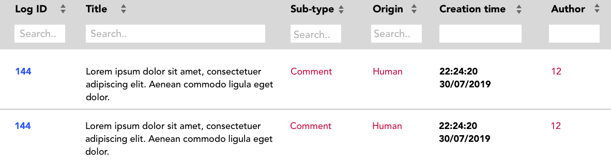
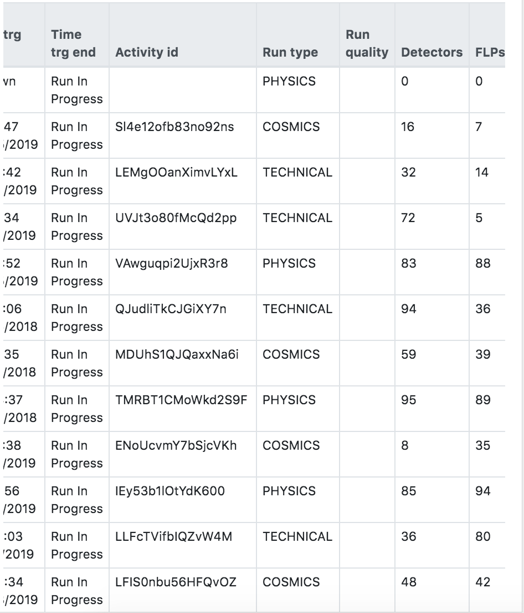
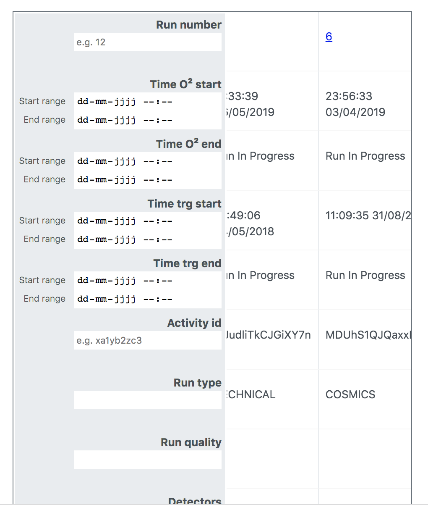
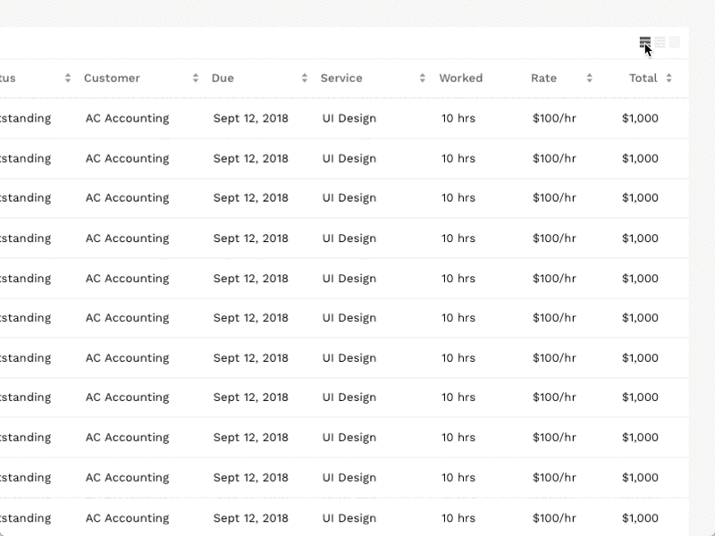
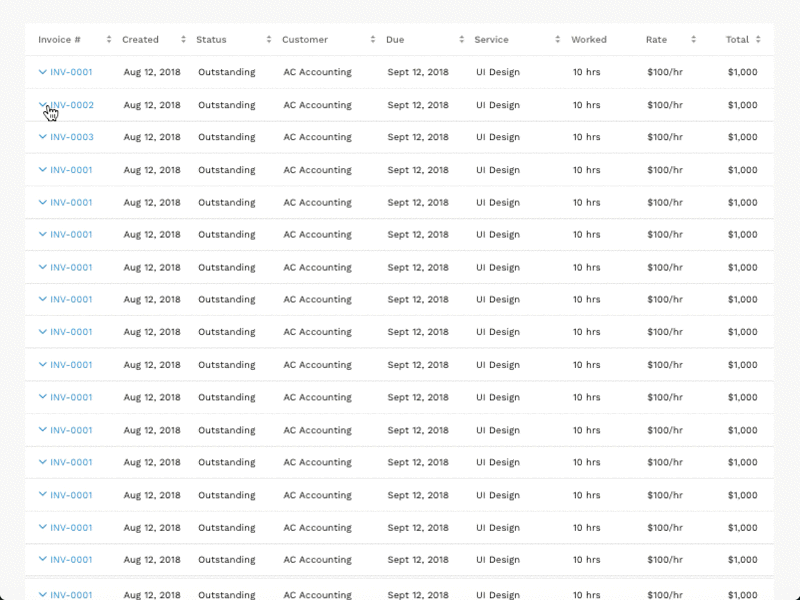
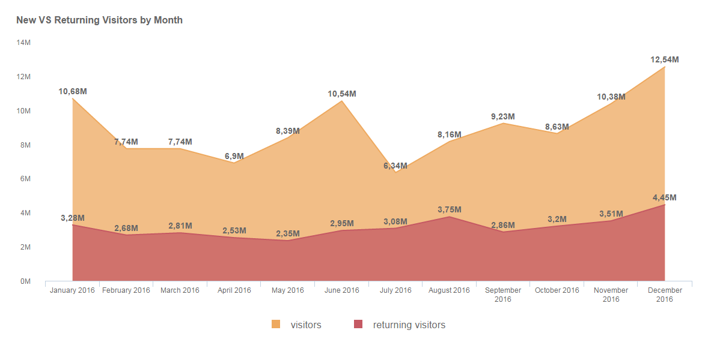
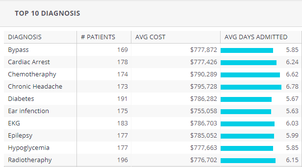

# Project 3 @cmda-minor-web · 2018-2019
> A project of one week for CERN. ICT-students have been working the back-end for almost the entire school year, our assignment is to create a better front-end focussed on the user and their work-flow.

## The user
The users are the professionals at CERN, so they can actually make sense of the data that comes through. They do repetitive work, for hours they look at the same tables and screens. I can't change their "chores" -as Maarten called them- but I could make the interface more pleasurable, more readable and more interactive. __The case I picked up is to make the interface responsive and more accessible.__

### MOSCOW 

#### Must haves:
- Strong hierarchy
    - What is important should look important, don't overstimulate the user.
    - More coloring in the tables, as this helps the user inline.
- Filtering aside inside column
    - By placing the filters next to the columns, the user is going back and forth. The most obvious user path is the user searching for only "Activity ID" and ignoring the rest.
    
    - When the search option is placed inside the column, the search query is aligned with the results
    
- Responsiveness
    When opening the page on mobile, the user has to still view the thead of the table for the `tbody` content to make sense. 
    
    This looks fine, but when the user scrolls down, the `thead` element is placed out of screen and the data has no context.
    
    
    On mobile, the user can scroll sideways while the `thead` element stays in place. The user can access all information in context.
- Progressive Disclosure
    - If I had more time on the project, the next step would be to hide the search fields in a drop down. Especially on mobile, the form elements take up a lot of space. When hiding them and toggeling a drop-down arrow, this enables interaction and keeps the user focussed. 

#### Should haves:

- Zero state
    - How to handle users that first come in contact with the interface? Have some build-in help on hover, for example the text _"Click to unfold"_ on content hidden behind a dropdown.
- Table styling 
    - Display toggle for details. The user story for this part isn't really clear to me, but it seems plausible that users look for a specific element and don't need to see al details from all rows.
    
    This example from [UX Design](https://uxdesign.cc/design-better-data-tables-4ecc99d23356) shows that a button to change the display can help users looking for different things. The image above only shows the difference in the density, but it could also work for quantity. By toggeling you would for instance change the display from all details, to only ID, title and date. The rest could be accessible in a dropdown. 
    - Another example from [UX Design](https://uxdesign.cc/design-better-data-tables-4ecc99d23356) is this one, where the rows are expandable and provide a step between the overview page and the detail page. This could solve a problem for when users aren't entirely sure if they found what they were looking for, without leaving the overview page. 

#### Could haves:

- An overview summary
    - Using [D3.js library](https://d3js.org/), you can easily construct a data visualistation and make it interactive. This could help people get an overview when not looking for a specific specimen, but checking the overall runs and logs. 
    
    This is an example of data, which could be placed in the header before the data.
    - Visually present data in the tables
    
    This could help with the readabilty of the tables, so users can easily inline and search.

### Nice example of how to make readable tables

