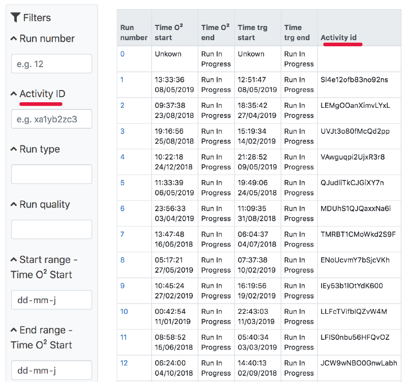

# Project 3 @cmda-minor-web · 2018-2019
> A project of one week for CERN. ICT-students have been working the back-end for almost the entire school year, our assignment is to create a better front-end focussed on the user and their work-flow.

## The user
The users are the professionals at CERN, so they can actually make sense of the data that comes through. They do repetitive work, for hours they look at the same tables and screens. I can't change their "chores" -as Maarten called them- but I could make the interface more pleasurable, more readable and more interactive. __The case I picked up is to make the interface responsive and more accessible.__

### MOSCOW 

#### Must haves:
- Strong hierarchy
    - What is important should look important, don't overstimulate the user.
    - More coloring in the tables, as this helps the user inline.
- Filtering aside inside coloms
    - By placing the filters next to the coloms, the user is going back and forth. The most obvious user path is the user searching for only "Activity ID" and ignoring the rest.
    

